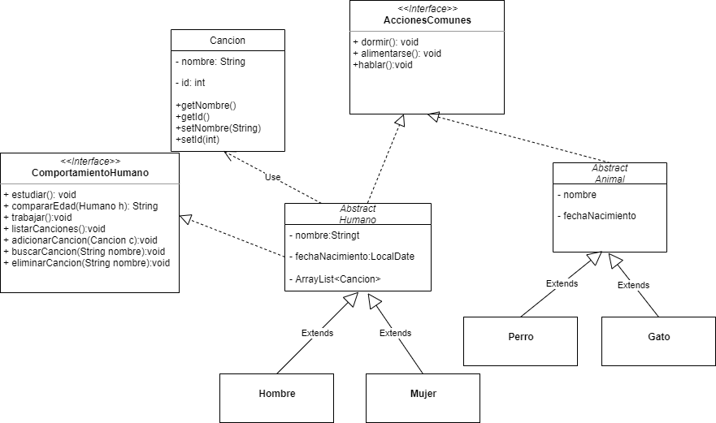

# Proyectos Java

## Tarea3_POO
Se tiene un Diagrama UML que representa la estructura de un programa. 

A partir de él se deberá realizar lo siguiente--->

### Instrucciones

#### En la interface Acciones Comunes

+dormir(): imprime Soy Nombre y estoy durmiendo (para hombre y mujer)

+dormir(): imprime zzZZZzzzZZZzz (para gato y perro)

+alimentarse(): imprime Estoy comiendo (para hombre y mujer)

+alimentarse(): imprime mmmmm (para gato y perro)

#### En la interface ComportamientoHumano

+estudiar(): imprime Estoy haciendo la tarea de POO.

+compararEdad(Humano): recibe un humano y devuelve el nombre del que tenga mayor edad.

+trabajar(): imprime Seré el o la mejor ingeniero en Sistemas que ha existido con trabajo duro y principios correctos.

El resto tiene que ver con la lista de canciones favorita de cada humano

